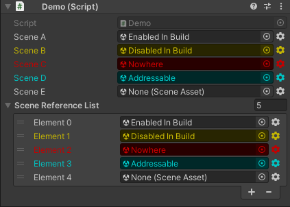
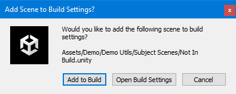
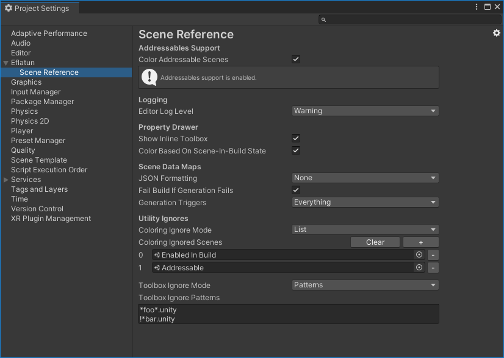
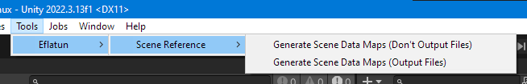

<h1 align="center">Eflatun.SceneReference</h1>
<br>

<p align="center">
    
</p>
<br>

<p align="center">
    Scene References for Runtime and Editor.
</p>

<p align="center">
    Strongly typed, robust, and reliable.
</p>

<p align="center">
    Provides GUID, Path, Build Index, Name, and Address.
</p>
<br>

<p align="center">
  <a href="https://github.com/starikcetin/Eflatun.SceneReference/"></a>
  &nbsp;
  <a href="https://openupm.com/packages/com.eflatun.scenereference/"></a>
</p>
<br>

# Installation

## Get `Eflatun.SceneReference`

### With OpenUPM (recommended)

1. Install `openupm-cli` via `npm`. You can skip this step if already have `openupm-cli` installed.

```console
npm install -g openupm-cli
```

2. Install `com.eflatun.scenereference` in your project. Make sure to run this command at the root of your Unity project.

```console
openupm add com.eflatun.scenereference
```

### With Git URL

Add the following line to the `dependencies` section of your project's `manifest.json` file. Replace `2.1.0` with the version you want to install.

```json
"com.eflatun.scenereference": "git+https://github.com/starikcetin/Eflatun.SceneReference.git#2.1.0"
```

_Although it is highly discouraged, you can replace `2.1.0` with `upm` to get the latest version instead of a specific one._

## Ignore Auto-Generated Map Files in Version Control

_You can skip this section if you are not using version control in your project._

It is generally a recommended practice to ignore auto-generated files in version control. `Eflatun.SceneReference` auto-generates JSON files with format `Assets/Resources/Eflatun/SceneReference/<MAP_NAME>.generated.json`. We recommend you ignore these files and their corresponding `.meta` files in your version control.

If you are using Git, you can do so by adding the following lines to your `.gitignore` file:

```gitignore
# Eflatun.SceneReference auto-generated map files
**/[Aa]ssets/Resources/Eflatun/SceneReference/*.generated.json
**/[Aa]ssets/Resources/Eflatun/SceneReference/*.generated.json.meta
```

## Optional Dependencies

### Addressables Support

`Eflatun.SceneReference` has support for addressables. It will be enabled or disabled automatically depending on whether you have the addressables package installed in your project. Please refer to the [Addressables Package Documentation](https://docs.unity3d.com/Packages/com.unity.addressables@latest) for information on how to install addressables package in your project.

> **Note**<br/>
> In accordance with the [Principle of least astonishment](https://en.wikipedia.org/wiki/Principle_of_least_astonishment), the public API and settings that concern addressables will still be visible even if addressables support is disabled. This is a deliberate design decision to prevent the overwhelming amount of compiler errors you would face otherwise, if you later decide to uninstall addressables from your project. This way, you only need to perform a minimal amount of refactors to your code in that case.

# Usage

1. Define your `SceneReference` serialized field:

```cs
// Import Runtime namespace
using Eflatun.SceneReference;

// You can define it by itself
[SerializeField] private SceneReference mySceneReference;

// Or in a collection
[SerializeField] private List<SceneReference> mySceneReferences;
```

2. Assign your scene to your `SceneReference` field in the inspector:


3. Use it!

```cs
// Import Runtime namespace
using Eflatun.SceneReference;

// You can access these anytime, anywhere
var sceneGuid = mySceneReference.Guid;
var scenePath = mySceneReference.Path;
var sceneBuildIndex = mySceneReference.BuildIndex;
var sceneName = mySceneReference.Name;

// You can only access these when the scene is currently loaded
var loadedScene = mySceneReference.LoadedScene

// You can only access these if you have addressables support enabled
var sceneAddress = mySceneReference.Address;
```

## Validation

You can check `State` property to make sure a `SceneReference` is completely valid before using it. It will also give you information regarding the type of the scene it references.

```cs
// Import Runtime namespace
using Eflatun.SceneReference;

if (mySceneReference.State == SceneReferenceState.Unsafe)
{
    // The scene is not safe to use. Something is wrong.
}

if (mySceneReference.State == SceneReferenceState.Regular)
{
    // The scene is safe to use. It references a regular scene.
}

// If you have addressables support enabled, you can also get this state:
if (mySceneReference.State == SceneReferenceState.Addressable)
{
    // The scene is safe to use. It references an addressable scene.
}

```

## Inline Validation & Fix Utilities

A scene will be accessible in runtime only if one of the following is true:

1. The scene is added and enabled in build settings.
2. The scene is in an addressables group.

`Eflatun.SceneReference` on the other hand, allows you to assign onto it any scene you wish. This behaviour may cause runtime bugs when loading scenes. To prevent these potential bugs, `Eflatun.SceneReference` provides inline validation and fix utilities.

In this example:



- `Scene A` field is assigned a scene that is added and enabled in build settings. All good here.
- `Scene B` field is assigned a scene that is disabled in build settings.
- `Scene C` field is assigned a scene that is neither in build settings nor addressable.
- `Scene D` filds is assigned an addressable scene. Again, all good here.
- `Scene E` field is not assigned anything. It is empty.
- Similarly for the `Scene Reference List` property.

> **Note**<br/>
> Addressable scenes are only available if addressables support is enabled.

If we click on the little gear (⚙️) icon to the right of the field, a toolbox popup will open that contains the fix utilities. For `Scene B` field, we get the following tools:


And for `Scene C` field, we get the following tools:


> **Note**<br/>
> You will only see the `Make addressable...` tool if you have addressables support enabled.

Clicking on the `Enable in build...` button gives us this prompt:


`Add to build...` button gives the following prompt:



And `Make addressable...` button gives the following prompt:


Using these prompts, we can quickly alleviate the situation, and prevent potential runtime bugs when using these scenes.

# Settings

`Eflatun.SceneReference` provides settings under the `Project Settings`.

Open the project settings via `Edit/Project Settings...` menu item.

Look for the `Eflatun` category in the left panel. Select the `Scene Reference` item.



## Addressables Support

> **Note**<br/>
> Settings under this category are only relevant if you have addressables support enabled.

### Color Addressable Scenes

Should we color the property to draw attention for addressable scenes?

Addressable scenes should be handled differently than regular scenes in runtime, through the addressables API. Therefore, you would want quickly identify if an `Eflatun.SceneReference` references an addressable scene or not.

It is recommended to leave this option at 'true', as it will help you identify many potential runtime errors.

> **Note**<br/>
> This setting does not apply to regular scenes. They have their own coloring mechanism. It is controlled by the _Color Based On Scene-In-Build State_ setting under the _Property Drawer_ category.

## Property Drawer

### Show Inline Toolbox

Should we show the inline gear (⚙️) buttons that open a toolbox?

Unity only bundles scenes that are added and enabled in build settings, and addressables only pack scenes that are in an Addressable Group. Therefore, you would want to make sure the scene you assign to a SceneReference is either added and enabled in build settings, or is in an addressable group. The toolbox provides tools for you to quickly take action in these cases.

It is recommended to leave this option enabled, as the toolbox saves you a lot of time.

### Color Based On Scene-In-Build State

Should we color the property to draw attention for scenes that are either not in build or disabled in build?

Unity only bundles scenes that are added and enabled in build settings. Therefore, you would want to validate whether the scene you assign to a SceneReference is added and enabled in build settings.

It is recommended to leave this option at 'true', as it will help you identify many potential runtime errors.

> **Note**<br/>
> This setting does not apply to addressable scenes. They have their own coloring mechanism. It is controlled by the _Color Addressable Scenes_ setting under the _Addressables Support_ category.

## Scene Data Maps

### Generation Triggers

Controls when the scene data maps get regenerated.

- After Scene Asset Change: Regenerate the map every time a scene asset changes (delete, create, move, rename).

- Before Enter Play Mode: Regenerate the map before entering play mode in the editor.

- Before Build: Regenerate the map before a build.

- After Packages Resolve: Regenerate the map after UPM packages are resolved.

- After Addressables Change: Regenerate the map after addressable group entries change. Only relevant if you have addressables support enabled.

It is recommended that you leave this option at _All_ unless you are debugging something. Failure to generate the map when needed can result in broken scene references in runtime.

> **Note**<br/>
> _All_ and _Everything_ are the same thing. They both represent all triggers.

### JSON Formatting

Controls the Scene Data Maps Generator's JSON formatting.

It is recommended to leave this option at _Indented_, as it will help with version control and make the generated files human-readable.

### Fail Build If Generation Fails

Should we fail a build if map generations fail?

Only relevant if _Before Build_ generation trigger is enabled.

It is recommended to leave this option at _true_, as a failed map generation can result in broken scene references in runtime.

# Advanced Usage

## Generated Files

`Eflatun.SceneReference` uses a JSON generator in editor-time to produce map files. You can find them at this location: `Assets/Resources/Eflatun/SceneReference`. They all end with `.generated.json`.

> **Warning**<br/>
> Map files are auto-generated, do not edit them. Any edits will be lost at the next generation.

## Running the Generator Manually

The generator runs automatically according to the triggers selected in the settings. However, if for some reason you need to run the generator yourself, you can do so. 

Running the generator has no side-effects.

### Via Menu Item

You can trigger the generator via a menu item. Find it under `Tools/Eflatun/Scene Reference/Run Scene Data Maps Generator`:



### In Editor Code

You can trigger the generator from your editor code:

```cs
// Import Editor namespace
using Eflatun.SceneReference.Editor;

// Run the generator. Only do this in Editor code!
SceneDataMapsGenerator.Run();
```

## Accessing Settings in Editor Code

You can read and manipulate `Eflatun.SceneReference` settings from your editor code.

```cs
// Import the Editor namespace
using Eflatun.SceneReference.Editor;

// Access a setting. Only do this in Editor code!
var generationTriggers = SettingsManager.SceneDataMaps.GenerationTriggers;

// Change a setting. Only do this in Editor code!
SettingsManager.SceneDataMaps.GenerationTriggers = GenerationTriggers.All;
```

> **Warning**<br/>
> Changing settings from code may have unintended consequences. Make sure you now what you are doing.

## Accessing the Maps Directly

You can access the maps directly from both runtime and editor code. There are no side-effects of accessing the maps directly.

In runtime, there are no performance penalties. The generated file is parsed automatically either upon the first access to the maps from a provider or during `RuntimeInitializeLoadType.BeforeSceneLoad`, whichever comes first. It is guaranteed that the generated file is parsed only once. Each provider does this for itself, there is no coordination between them.

In editor, there are also no performance penalties except for one case. The generator assigns the map directly to the providers upon every generation. This prevents unnecessarily parsing the map file. However, if the providers lose the values assigned by the generator due to Unity [reloading the domain](https://docs.unity3d.com/Manual/DomainReloading.html), and some code tries to access the map before the generator runs again, then the providers have to parse the map file themselves. This is what happens in that scenario:

1. Generator runs and directly assigns the map to the providers.
2. Something happens which triggers Unity to [reload the domain](https://docs.unity3d.com/Manual/DomainReloading.html).
3. You access the map from a provider.
4. Provider checks to see if it still has the map values, and realizes they are lost.
5. Provider parses the map file.

### Scene GUID to Path Map

The `SceneGuidToPathMapProvider` static class is responsible for providing the scene GUID to scene path mapping to the rest of the code. There are two maps, one maps from GUIDs to paths, and the other one maps from paths to GUIDs. Both maps are inversely equivalent.

```cs
// Import the Runtime namespace
using Eflatun.SceneReference;

// Get the scene path from a scene GUID. You can do this both in runtime and in editor.
var scenePath = SceneGuidToPathMapProvider.SceneGuidToPathMap[sceneGuid];

// Get the scene GUID from a scene path. You can do this both in runtime and in editor.
var sceneGuid = SceneGuidToPathMapProvider.ScenePathToGuidMap[scenePath];
```

### Scene GUID to Address Map

> **Note**<br/>
> This map is only relevant if addressables support is enabled.

The `SceneGuidToAddressMapProvider` static class is responsible for providing the scene GUID to scene address mapping to the rest of the code. Unlike `SceneGuidToPathMapProvider`, this class cannot provide an inverse map, because the address of an asset is not guaranteed to be unique due to the design of addressables. Instead, it provides two methods called `GetGuidFromAddress` and `TryGetGuidFromAddress` that serve the same purpose.

Getting the GUID from address can fail in following cases:
1. No scene with the given address found in the map (`AddressNotFoundException`).
2. Multiple scenes found with the given address in the map (`AddressNotUniqueException`).
3. Addressables support is disabled (`AddressablesSupportDisabledException`).

```cs
// Import the Runtime namespace
using Eflatun.SceneReference;

// Get the scene address from a scene GUID. You can do this both in runtime and in editor.
var sceneAddress = SceneGuidToAddressMapProvider.SceneGuidToAddressMap[sceneGuid];

// Get the scene GUID from a scene address. You can do this both in runtime and in editor.

// First way. Will throw exceptions on faliure.
var sceneGuid = SceneGuidToAddressMapProvider.GetGuidFromAddress(sceneAddress);

// Second way. Returns a bool that represents success or failure.
if(SceneGuidToAddressMapProvider.TryGetGuidFromAddress(sceneAddress, out var sceneGuid)) 
{
    // Success. sceneGuid is valid.
}
else 
{
    // Failure. sceneGuid is invalid.
}
```

## Overriding Inline Validation Settings Per Field

You can override the behaviour of the inline validation project settings on a per-field basis using the `[SceneReferenceOptions]` attribute. For example, in order to disable all inline validations, use the attribute as such:

```cs
[SceneReferenceOptions(SceneInBuildColoring = ColoringBehaviour.Disabled, Toolbox = ToolboxBehaviour.Disabled, AddressableColoring = ColoringBehaviour.Disabled)]
[SerializeField] private SceneReference scene;
```

For all arguments, passing `Enabled` or `Disabled` will force that behaviour to be enabled or disabled respectively, disregarding the project settings. `DoNotOverride` makes the argument respect the project settings. `DoNotOverride` is the default value. 

You don't have to supply both fields at once. Missing fields will have the default value, which is `DoNotOverride`. For example, the following code disables the toolbox, but makes coloring respect project settings:

```cs
[SceneReferenceOptions(Toolbox = ToolboxBehaviour.Disabled)]
[SerializeField] private SceneReference scene;
```

> **Note**<br/>
> `AddressableColoring` argument is only relevant if addressables support is enabled.

## Custom Serialization

Serializers listed under this section are tested and supported.

If you come across any problems while using these serializers, or if you want another serializer to be supported, please [open an issue](https://github.com/starikcetin/Eflatun.SceneReference/issues).

### JSON serialization via `Newtonsoft.Json`

Example `SceneReference` serialization to Json and back via `Newtonsoft.Json`:

```cs
using Eflatun.SceneReference;
using Newtonsoft.Json;

// Serialize
SceneReference sceneRef = /* ... */;
var serialized = JsonConvert.SerializeObject(sceneRef);

// Deserialize
string json = /* ... */;
SceneReference deserialized = JsonConvert.DeserializeObject<SceneReference>(json);
```

### Binary serialization via `System.Runtime.Serialization.Formatters.Binary`

> **Warning**<br/>
> We strongly advise against using `BinaryFormatter` as it is inconsistent and has inherent security risks. Only use it if you absolutely have to.

Example `SceneReference` serialization to binary and back via `System.Runtime.Serialization.Formatters.Binary`:

```cs
using Eflatun.SceneReference;
using System;
using System.IO;
using System.Runtime.Serialization.Formatters.Binary;

// Serialize
SceneReference sceneRef = /* ... */;
var bf = new BinaryFormatter();
using var ms = new MemoryStream();
bf.Serialize(ms, sceneRef);
var serializedBytes = ms.ToArray();
var serializedBase64 = Convert.ToBase64String(serializedBytes);

// Deserialize
byte[] bytes = /* ... */;
var bf = new BinaryFormatter();
using var ms = new MemoryStream(bytes);
SceneReference deserialized = bf.Deserialize(ms) as SceneReference;
```

### XML serialization via `System.Xml`

Example `SceneReference` serialization to XML and back via `System.Xml`:

```cs
using Eflatun.SceneReference;
using System.IO;
using System.Text;
using System.Xml;
using System.Xml.Serialization;

// Serialize
SceneReference sceneRef = /* ... */;
var xmlSerializer = new XmlSerializer(typeof(SceneReference));
var sb = new StringBuilder();
using var xmlWriter = XmlWriter.Create(sb);
xmlSerializer.Serialize(xmlWriter, sceneRef);
var serialized = sb.ToString();

// Deserialize
string xml = /* ... */;
var xmlSerializer = new XmlSerializer(typeof(SceneReference));
using var stringReader = new StringReader(xml);
using var xmlReader = XmlReader.Create(stringReader);
SceneReference deserialized = xmlSerializer.Deserialize(xmlReader) as SceneReference;
```

## Creating Instances in Code

You can create instances of `SceneReference` in code. To facilitate this, it exposes constructors and factory methods.

```cs
// Empty (and subsequently invalid)
var empty = new SceneReference();

// From Scene GUID
string sceneGuid = /* ... */;
var fromSceneGuid = new SceneReference(sceneGuid);

// From Scene Path
string scenePath = /* ... */;
var fromScenePath = SceneReference.FromScenePath(scenePath);

// Fom Scene Address
// Will throw AddressablesSupportDisabledException if addressables support is disabled.
string sceneAddress = /* ... */;
var fromSceneAddress = SceneReference.FromAddress(sceneAddress);

// From Scene Asset 
// You can only do this in Editor code.
UnityEngine.Object sceneAsset = /* ... */;
var fromSceneAsset = new SceneReference(sceneAsset);
```

> **Warning**<br/>
> Constructors and factory methods validate their arguments and throw exceptions of type `SceneReferenceCreationException` if they are invalid.

> **Warning**<br/>
> The default constructor always creates an empty instance, but it never throws.

> **Warning**<br/>
> The constructor that accepts a scene asset of type `UnityEngine.Object` is for Editor-use only. Do NOT use it in runtime code.

> **Warning**<br/>
> `FromAddress` factory method throws `AddressablesSupportDisabledException` if addressables support is disabled.

# Exceptions

## `EmptySceneReferenceException`

Thrown if a `SceneReference` is empty (not assigned anything).

To fix it, make sure the `SceneReference` is assigned a valid scene asset.

You can avoid it by making sure the `State` property is not `Unsafe`.

## `InvalidSceneReferenceException`

Thrown if a `SceneReference` is invalid. This can happen for these reasons:

1. The `SceneReference` is assigned an invalid scene, or the assigned asset is not a scene. To fix this, make sure the `SceneReference` is assigned a valid scene asset.

2. The Scene GUID to Path Map is outdated. To fix this, you can either manually run the map generator, or enable all generation triggers. It is highly recommended to keep all the generation triggers enabled.

You can avoid it by making sure the `State` property is not `Unsafe`.

## `SceneReferenceCreationException`

Thrown when something goes wrong during the creation of a `SceneReference`. 

It can happen for many different reasons. 

The exception message contains the particular reason and suggestions on how to fix it.

## `AddressNotFoundException`

Thrown if a given address is not found in the Scene GUID to Address Map. This can happen for these reasons:

1. The asset with the given address either doesn't exist or is not a scene. To fix this, make sure you provide the address of a valid scene.

2. The scene GUID to Address Map is outdated. To fix this, you can either manually run the generator, or enable generation triggers. It is highly recommended to keep all the generation triggers enabled.

You cannot avoid this exception. It indicates that there is a bug in your project.

> **Note**<br/>
> This exception will never be thrown if addressables support is disabled.

## `AddressNotUniqueException`

Thrown if a given address matches multiple entries in the Scene GUID to Address Map. This can happen for these reasons:

1. There are multiple addressable scenes with the same given address. To fix this, make sure there is only one addressable scene with the given address.

2. The Scene GUID to Address Map is outdated. To fix this, you can either manually run the generator, or enable generation triggers. It is highly recommended to keep all the generation triggers enabled.

You cannot avoid this exception. It indicates that there is a bug in your project.

> **Note**<br/>
> This exception will never be thrown if addressables support is disabled.

## `SceneNotAddressableException`

Thrown if addressables-specific operations are attempted on a `SceneReference` that is assigned a non-addressable scene.

You can avoid this exception by making sure the `State` property is `Addressable`.

> **Note**<br/>
> This exception will never be thrown if addressables support is disabled.

## `AddressablesSupportDisabledException`

Thrown if an operation that requires addressables support is attempted while addressables support is disabled.

You can avoid this exception by making sure addressables support is enabled.

## `SceneReferenceInternalException`

This exception is not part of the public API. It indicates that something has gone wrong internally. It is not meant to be catched, fixed, or avoided by user code.

If you come across this exception, make sure to create a bug report by [opening an issue](https://github.com/starikcetin/Eflatun.SceneReference/issues) and including the relevant information in the exception message.

# Acknowledgements

* This project is inspired by [JohannesMP's SceneReference](https://github.com/JohannesMP/unity-scene-reference). For many years I have used his original implementation of a runtime Scene Reference. Many thanks to [@JohannesMP](https://github.com/JohannesMP) for saving me countless hours of debugging, and inspiring me to come up with a more robust way to tackle this problem that Unity refuses to solve.

* README header inspired by [Angular's README](https://github.com/angular/angular/blob/main/README.md).

# Similar Projects
If this project doesn't suit your needs, you can always let me know by [opening an issue](https://github.com/starikcetin/Eflatun.SceneReference/issues) or [creating a discussion](https://github.com/starikcetin/Eflatun.SceneReference/discussions) and I will see what we can do about it. If you think you absolutely need another approach, here are some similar projects to check out:

* https://github.com/JohannesMP/unity-scene-reference
* https://github.com/NibbleByte/UnitySceneReference

# License

MIT License. Refer to the [LICENSE.md](LICENSE.md) file.

Copyright (c) 2022 [S. Tarık Çetin](https://github.com/starikcetin)
